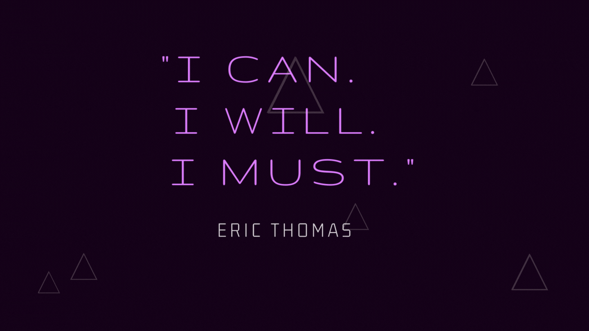

 

## *About Me*

  
Click to expand!

  
### Nice to virtually meet you!  
Hello, my name's Raul Zarate.🤝 I graduated from CodeFellows, a fully-stacked, project-based Software Development career accelerator! I currently work at CodeFellows as a Tutor Assistant. Where I aid Students to take on Advanced Data Structures and Algorithms concepts on a day bases. 

Weekly, I will be updating with new projects! My current goals include:  
- [ ] Develop Machine Learning projects.
- [ ] Implement Data Structure and Algorithms.
- [ ] Push to GitHub at least once a week.

My personal interests include listening to upcoming musci artist, space focused science fiction books, solving the rubiks cube personal record time, and being outdoors! Most importantly, I love eating street food.

## *Connect With Me*
<a href="mailto:zarater.raul@gmail.com">Send Me an Email</a> | [LinkedIn](https://www.linkedin.com/in/raul-zarate/)

## *Portfolios*
<table>
  <tr>
    <td>
      <a href="https://dreamy-bonbon-4dd60a.netlify.app">Portfolio Website</a>
    </td>
    <td>
    <a href="https://github.com/zaratr/zaratr.github.io">github.io</a>
    </td>
    <td>
      <a href="https://www.gitshowcase.com/zaratr">GitShowcase</a>
    </td>
    <td>
      <a href="https://www.hackerrank.com/zarater_raul">HackerRank</a>
    </td>
    <td>
      <a href="https://leetcode.com/user2052J/">LeetCode</a>
    </td>
  </tr>
</table>

## *Tools*
                   

## Github Stats  

  

  

   

  

<!-- 

 -->

 

 

 
   
<!-- img src="https://komarev.com/ghpvc/?username=zaratr&&style=flat-square" align="center" -->

 
  

